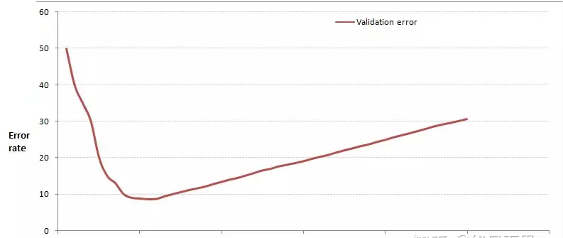

## K Nearest Neighbors（KNN）算法

KNN算法是有监督学习中的分类算法，KNN原理就是当预测一个新的值x的时候，根据它距离最近的K个点是什么类别来判断x属于哪个类别。关键在于K值的选取和点距离的计算。

### 一、距离计算

常见的曼哈顿距离计算、欧式距离计算等，不过通常KNN算法使用欧式距离比较多，简单说，拿二维平面为例，二维空间两个点的欧式距离计算公式如下：
$$
d(x,y) = \sqrt{(x_2-x_1)^2 + (y_2-y_1)^2}
$$
如果是多维空间公式为:
$$
d(x,y) = \sqrt{(x_2-x_1)^2 + (y_2-y_1)^2 + (z_2-z_1)^2 +...}
$$

当你增大k的时候，一般错误率会先降低，因为有周围更多的样本可以借鉴了，分类效果会变好。但注意，当K值更大的时候，错误率会更高，很好理解，如果一共35个样本，当K增到30的时候，几乎所有点都认为是一个类别，已经失去了意义。
